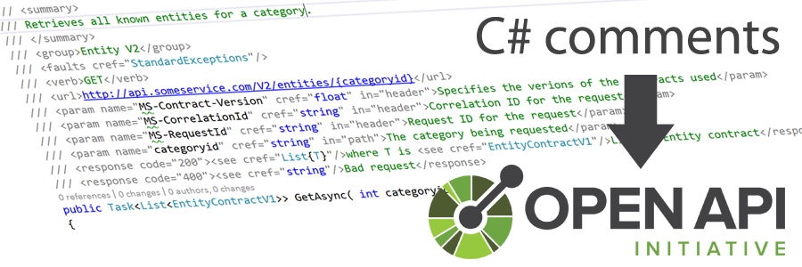
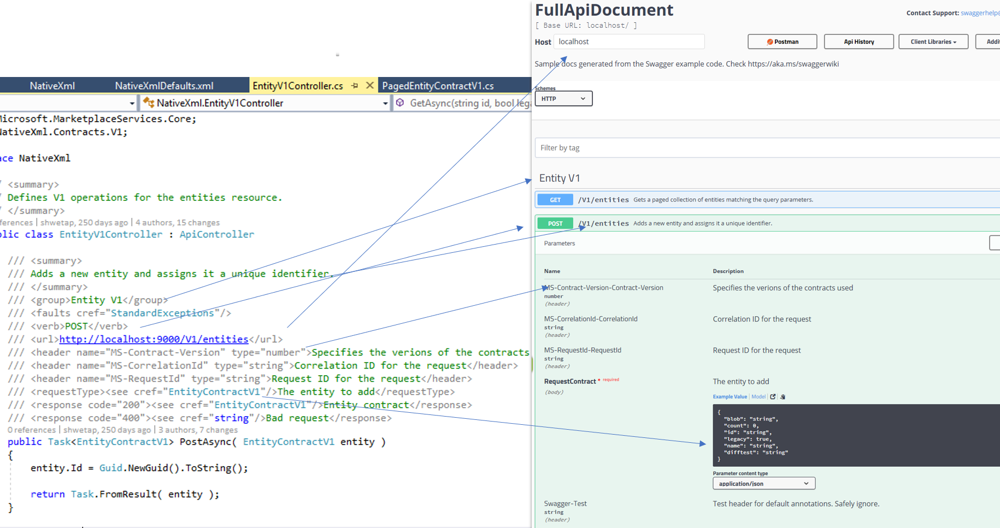
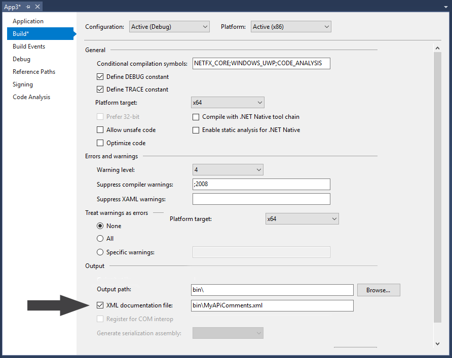

[](https://ci.appveyor.com/project/MicrosoftOpenAPINETAdmin/openapi-net-csharpcomment/branch/master)



# Convert C# Annotations to OpenAPI.NET [Preview]
[Disclaimer: This repository is in a preview state. Expect to see some iterating as we work towards the final release candidate slated for late summer 2018. Feedback is welcome!]


### Welcome!
This component is the first by-product of Microsoft's supported base [OpenAPI.NET](http://aka.ms/openapi) object model. The module is designed to convert your native annotation XML from your API code into a OpenAPI document object. All you need to do is follow a simple annotation schema for your API controller comments, and you automatically get all the benefits of the OpenAPI and its related Swagger tooling.

### Overview

We've made an effort to develop an annotation model that maps very closely to the native .NET comment structure for the C# language. In general, the below image describes the general concept of how this utility can translate your annotation XML to an [OpenAPI.NET document](https://github.com/Microsoft/OpenAPI.NET/blob/master/src/Microsoft.OpenApi/Models/OpenApiDocument.cs).


Consult our [Wiki](https://github.com/Microsoft/OpenAPI.NET.CSharpAnnotations/wiki) for specific guidance and examples on how to annotate your controllers.

_Remarks: Throughout the README and the Wiki, we will use the following terminology:_

_**C# Comments** refers to the comments in the code_

```csharp
/// <summary>
/// Sample Get 1
/// </summary>
/// <group>Sample V1</group>
/// <verb>GET</verb>
/// <url>http://localhost:9000/V1/samples/{id}?queryBool={queryBool}</url>
/// <param name="sampleHeaderParam1" cref="float" in="header">Header param 1</param>
/// <param name="id" cref="string" in="path">The object id</param>
/// <param name="queryBool" required="true" cref="bool" in="query">Sample query boolean</param>
/// <response code="200"><see cref="SampleObject1"/>Sample object retrieved</response>
/// <returns>The sample object 1</returns>
```

_**Annotation** or **Annotation XML** refers to the compiler built version of the above comments_

```xml
<member name="M:Microsoft.OpenApi.CSharpComment.Reader.Tests.SampleApis.Controllers.SampleControllerV1.SampleGet1(System.String,System.Boolean)">
  <summary>
  Sample Get 1
  </summary>
  <group>Sample V1</group>
  <verb>GET</verb>
  <url>http://localhost:9000/V1/samples/{id}?queryBool={queryBool}</url>
  <param name="sampleHeaderParam1" cref="T:System.Object" in="header">Header param 1</param>
  <param name="id" cref="T:System.String" in="path">The object id</param>
  <param name="queryBool" required="true" cref="T:System.Boolean" in="query">Sample query boolean</param>
  <response code="200"><see cref="T:Microsoft.OpenApi.CSharpComment.Reader.Tests.Contracts.SampleObject1"/>Sample object retrieved</response>
  <returns>The sample object 1</returns>
</member>
```

_This Document Generator consumes the above annotations (outputted from MSBuild.exe) to create OpenAPI.NET objects._

### Mechanics
The following items are needed as input to the Document Generator:

- Paths to the Annotation XML documentation files from your MSBuild.exe output. (`List<string>`)
- Paths to the Assemblies (DLLs or EXEs) that contain the data types referenced in the comments. (`List<string>`)
- Version of the OpenAPI document. (`string`) _Note this is not the OpenAPI specification version. This corresponds to the version field of the [Info object](https://github.com/Microsoft/OpenAPI.NET/blob/master/src/Microsoft.OpenApi/Models/OpenApiInfo.cs) in an OpenAPI document._
- Version of the filter set ([`FilterSetVersion` enum](https://github.com/Microsoft/OpenAPI.NET.CSharpAnnotations/blob/26dd7cc6efc2bb79338b605ed46fa51a83676f2e/src/Microsoft.OpenApi.CSharpAnnotations.DocumentGeneration/FilterSet.cs))

After you've correctly annotated your C# code, you'll need to build your solution and then retrieve the output annotation XML file where MSBuild.exe aggregates the projects comments. This file is what this utility will use to convert your comments into an OpenAPI.NET object.


### Simple Example Code
Here's a simple example. The `OpenApiGeneratorConfig` class is instantited with two lists, the document version, and the filter set version. The first list contains the paths to your Annotation XML documentation files. The second list contains the paths to the assemblies where classes referenced in the C# XML comments can be found.

For example, if you have a C# comment for a response type as follows:
```csharp
/// <response code="200"><see cref="SampleObject1"/>Sample object retrieved</response>
```
You will need to include the path to the assembly file that contains the `SampleObject1` class. 

Generating your OpenAPI.NET document should look something like this:
```csharp
var input = new OpenApiGeneratorConfig(
    annotationXmlDocuments: new List<XDocument>()
    {
        XDocument.Load(@"C:\TestData\Annotation.xml"),
        XDocument.Load(@"C:\TestData\Contracts.xml"),
    },
    assemblyPaths: new List<string>()
    {
        @"C:\TestData\Service.dll",
        @"C:\TestData\Contract.dll"
    },
    openApiDocumentVersion: "V1",
    filterSetVersion: FilterSetVersion.V1
);

GenerationDiagnostic result;

var generator = new OpenApiGenerator();

IDictionary<DocumentVariantInfo,OpenApiDocument> openApiDocuments = generator.GenerateDocuments(
    openApiGeneratorConfig: input,
    generationDiagnostic: out result
);
```
In this example, the generated `openApiDocuments` should contain valid OpenAPI.NET document(s) for your API based on the provided annotation XMLs and contract assemblies.

### Newtonsoft (JSON.NET)
C# Document Generator supports fetching Newtonsoft.Json `JsonProperty` and `JsonIgnore` attributes. If your service contracts use Newtonsoft, you will have to include the same version of `Newtonsoft.Json.dll` as used by service contracts in the assembly paths.

### Optional Advanced Configuration
Document generator also allows you to provide an optional advanced configuration as input in `OpenApiGeneratorConfig.AdvancedConfigurationXmlDocument`
which enables:

- Specifying annotations that logically apply to either the entire document or to certain set of operations.
- Generate multiple documents based on the variant information provided.

The configuration XML is handcrafted (NOT generated from Visual Studio build).

Consult our [Wiki](https://github.com/Microsoft/OpenAPI.NET.CSharpAnnotations/wiki/Advanced-Configuration-XML) for specific guidance and examples on how to draft this XML.

# Contributing
This project welcomes contributions and suggestions.  Most contributions require you to agree to a
Contributor License Agreement (CLA) declaring that you have the right to, and actually do, grant us
the rights to use your contribution. For details, visit https://cla.microsoft.com.

When you submit a pull request, a CLA-bot will automatically determine whether you need to provide
a CLA and decorate the PR appropriately (e.g., label, comment). Simply follow the instructions
provided by the bot. You will only need to do this once across all repos using our CLA.

This project has adopted the [Microsoft Open Source Code of Conduct](https://opensource.microsoft.com/codeofconduct/).
For more information see the [Code of Conduct FAQ](https://opensource.microsoft.com/codeofconduct/faq/) or
contact [opencode@microsoft.com](mailto:opencode@microsoft.com) with any additional questions or comments.
